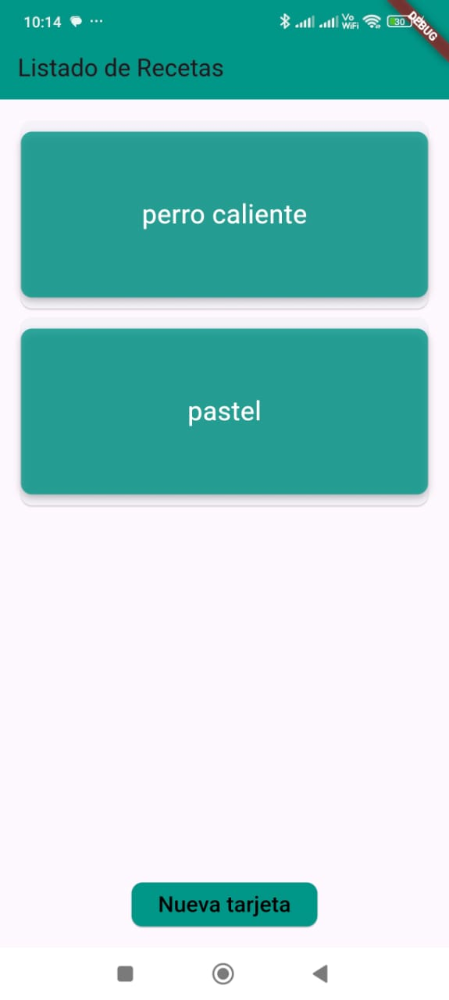
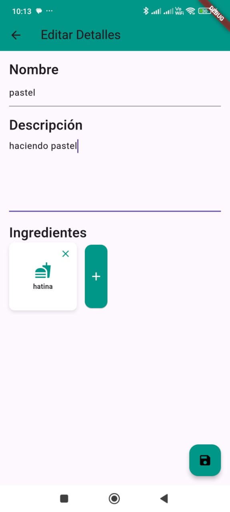
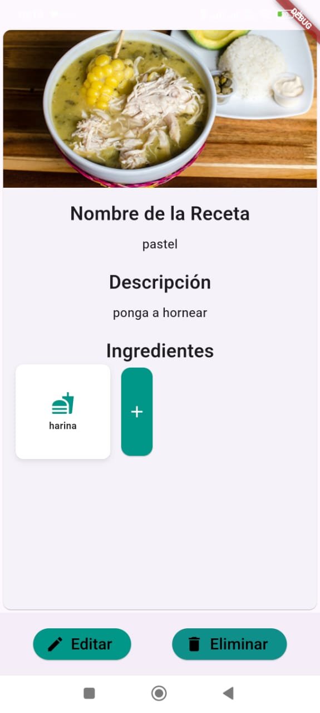

# FlavorBox  

**FlavorBox** es una aplicación Flutter diseñada para gestionar recetas. Permite a los usuarios agregar, ver, editar y eliminar recetas. Cada receta contiene un nombre, una lista de ingredientes y una descripción.  

## **Estructura del Proyecto**  

El proyecto sigue una arquitectura limpia, separando las responsabilidades en capas:  

### **1. Data**  
Esta capa contiene las implementaciones específicas de la fuente de datos, como modelos, servicios y repositorios.  
- **`models`**: Define los modelos de datos utilizados en la aplicación, como `recipe_model.dart`.  
- **`services`**: Implementa servicios para manejar datos. Actualmente se usa `json_service.dart` para simular operaciones CRUD con un archivo JSON.  
- **`repositories`**: Implementa los repositorios que interactúan con la fuente de datos.  

### **2. Domain**  
Esta capa define la lógica de negocio de la aplicación.  
- **`entities`**: Contiene entidades puras que representan objetos del dominio, como `recipe.dart`.  
- **`usecases`**: Define los casos de uso de la aplicación, como agregar, eliminar, editar y obtener recetas.  
- **`repositories`**: Define las interfaces que aseguran que la capa de dominio no dependa de implementaciones específicas.  

### **3. Presentation**  
Esta capa gestiona la interfaz de usuario.  
- **`screens`**: Contiene las pantallas principales de la aplicación, como `home_screen.dart`, `detail_screen.dart` y `form_screen.dart`.  
- **`widgets`**: Incluye componentes reutilizables, como `ingredient_card.dart`.  

### **4. Main**  
El archivo `main.dart` es el punto de entrada de la aplicación.  

## **Características Principales**  

1. **Agregar Recetas**  
   - Navega a la pantalla de formulario para agregar una nueva receta con un nombre, ingredientes y descripción.  

2. **Ver Detalles de Recetas**  
   - Explora los detalles completos de cada receta desde la pantalla principal.  

3. **Editar Recetas**  
   - Modifica las recetas existentes desde la pantalla de detalles.  

4. **Eliminar Recetas**  
   - Borra recetas no deseadas con un solo clic desde la pantalla de detalles.  

## **Consideraciones Técnicas**  

1. **Gestión de Datos**  
   - Los datos se manejan a través de un servicio que utiliza un archivo JSON para simular una base de datos. Esto asegura la flexibilidad y permite realizar operaciones CRUD sin depender de SQLite.  

2. **Arquitectura Limpia**  
   - La aplicación está organizada en capas (Data, Domain, Presentation) para mantener un bajo acoplamiento y alta cohesión, mejorando la escalabilidad y mantenibilidad.  

3. **Gestión de Estado**  
   - El estado de la lista de recetas se actualiza utilizando los casos de uso y la arquitectura limpia.  

4. **Validación de Datos**  
   - Se incluyen validaciones básicas en el formulario para evitar registros vacíos o incompletos.  

5. **Navegación**  
   - Se implementa una navegación limpia, centralizando rutas y evitando acoplar widgets con resultados directos de navegación.  

## **Ejecución del Proyecto**  

### **Requisitos Previos**  
- Flutter SDK 3.x instalado en tu máquina.  
- Editor de código como Visual Studio Code o Android Studio.  

### **Instrucciones para Configuración**  
1. Clona este repositorio en tu máquina local:  
   ```bash  
   git clone https://github.com/tu-usuario/flavorbox.git  
   cd flavorbox  
   flutter run  
  ```

## Uso



1. **Agregar una Receta**: Toca el botón "Agregar Nueva Receta" en la `HomeScreen` para navegar a la `FormScreen`. Llena los detalles y guarda.

2. **Ver Detalles de la Receta**: Toca una tarjeta de receta en la `HomeScreen` para navegar a la `DetailScreen`.

3. **Editar una Receta**: En la `DetailScreen`, toca el botón "Editar" para navegar a la `FormScreen` con detalles prellenados.
4. **Eliminar una Receta**: En la `DetailScreen`, toca el botón "Eliminar" para eliminar la receta y regresar a la `HomeScreen`.